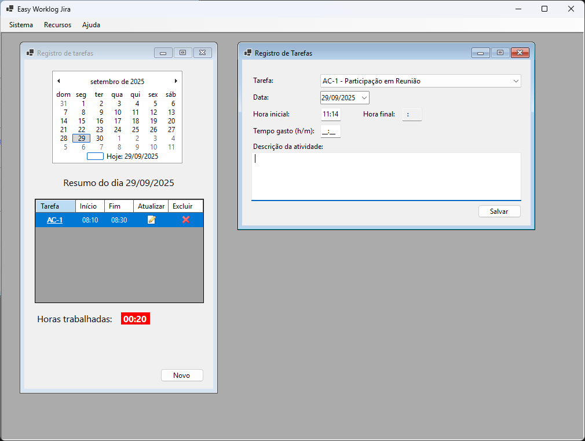
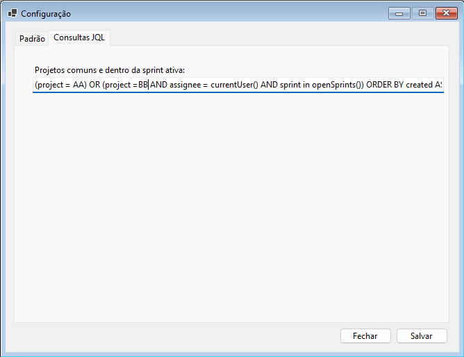

# Easy Worklog Jira

 This project arose from the need for a more practical system for recording task hours, including all the necessary information, making it easier to track timekeeping.

## Features

System resources:

| Item | Description | Available? |
| :--- | :----       | :---:      |
| 1    | Querying tasks recorded by the user | Yes   |
| 2    | Querying tasks from the previous day based on the daily meeting period. Depending on the time a daily meeting occurs, the user can configure the system to automatically, when opening the activity query, query the previous day's tasks within the daily period | Yes   |
| 3    | Insertion of activity log           | Yes   |
| 4    | Edition of activity log             | Yes   |
| 5    | Details of activity                 | Yes   |
| 6    | Delete activity log                 | Yes   |
| 7    | Configuration form of the application | Yes   |

> **Observation**: the system was built using the old but functional .NET Windows Forms technology.
Once all features are complete, a [WFP](https://learn.microsoft.com/en-us/dotnet/desktop/wpf/overview/) (Windows Presentation Foundation) version will be implemented to utilize modern features.

## Main menu of system (windows forms version)

## JQL Setup

Easy Worklog Jira has a JQL (Jira Query Language) configuration to correctly filter projects available to logged-in users.
JQL can be obtained from your company's Jira administrator. Here are some usage examples:

`(project = AA) OR (project = BB AND assignee = currentUser() AND sprint in openSprints()) ORDER BY created ASC`

This query should be entered in the JQL tab, as shown in the image:

NOTE: There is no configuration for JQL, the default query value is:

`sprint in openSprints() AND assignee = currentUser() ORDER BY created DESC`

For a better understanding see the Jira documentation on [JQL](https://support.atlassian.com/jira-service-management-cloud/docs/use-advanced-search-with-jira-query-language-jql/)
